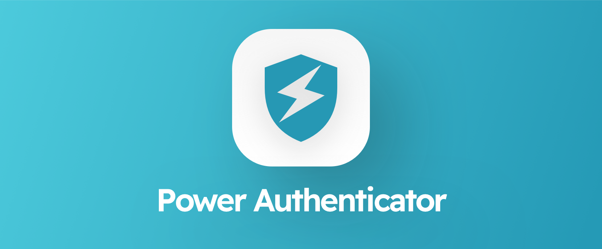

# Power Authenticator

> Cross-platform Authenticator - with highly secure multi-device sync

> [!WARNING]
> **Work in progress** - This project is under active development and not ready for use yet. Please feel free contribute
> by submitting PR's or issues (feature requests/feedback).

## About

PowerAuthenticator is a free and open-source app for managing 2FA tokens. Sync your tokens across deviceis and view them
in the
mobile app, desktop app or automatically fill them in your browser. PowerAuthenticator uses the cloud storage you
already own
and uses strong encryption to all your tokens safe.

**Features**

- Easy to use **mobile app**, **browser extension** and **desktop app**
- **Sync** across devices
- Use your own cloud storage (Google Drive, iCloud, WebDav, SFTP and more)
- **Autofill** in browser
- Sync adhering to **"Something you own"-principle**
- All basic Authenticator features
    - Scan QR codes
    - Add tokens manually
    - Import / Export token from other Authenticator
    - View and manage tokens
    - Export

**Philosophy**

Two-factor authentication is very important to keep your accounts secure. However, it's not that easy to actually keep
your tokens safe as well. There's many stories of people losing their mobile phone and all 2FA tokens with it. The
solution of course is to not have your tokens on just one device.

Some Authenticator apps have solved this with cloud sync, like Google Authenticator. There's a big downside though;
this breaks the "Something you own"-principle. Cloud sync stores your 2FA tokens in the cloud behind a password
(something you know). This is lowering your security because it's now possible access your tokens simply by knowing your
password.

PowerAuthenticator wants to maintain the "Something you own"-principle ánd offer a great user experience.
PowerAuthenticator has
multi-device sync and uses strong keys that never leave the devices (adhering to the something you own principle). All
data that does leave your devices (uploaded to your own cloud storage) is strongly encrypted by those on-device keys.

## Compare alternatives

|                                                                | Power Authenticator | Google Authenticator | Microsoft Authenticator | Authy | 2FAs                     | Ravio      |
|----------------------------------------------------------------|---------------------|----------------------|-------------------------|-------|--------------------------|------------|
| **General**                                                    |
| Free                                                           | ✅                   | ✅                    | ✅                       | ✅     | ✅                        | ✅          |  
| Open source                                                    | ✅                   | ❌                    | ❌                       | ❌     | ✅                        | ✅          |
| Accountless                                                    | ✅                   | ❌                    | ❌                       | ❌     | ✅                        | ❌          |  
| Protected against device loss                                  | ✅                   | ✅                    | ✅                       | ✅     | ❌                        | ❌          |  
| **Platforms**                                                  |                     |
| Cross-platform                                                 | ✅                   | ✅                    | ✅                       | ✅     | ❌                        | ❌ iOS only |
| Mobile app                                                     | ✅                   | ✅                    | ✅                       | ✅     | ✅                        | ✅          |    
| Desktop app                                                    | ✅                   | ❌                    | ❌                       | ❌\**  | ❌                        | ✅\*        | 
| Browser extension                                              | ✅                   | ❌                    | ❌                       | ❌     | ✅\*                      | ❌          |      
| **Features**                                                   |
| Backup / sync                                                  | ✅                   | ✅                    | ✅                       | ✅     | ✅                        | ✅          |       
| Autofill                                                       | ✅                   | ❌                    | ❌                       | ❌     | ❌                        | ❌          |      
| "Something-you-own"-principle                                  | ✅                   | ❌\***                | ❌                       | ✅     | ✅                        | ✅          |     
| Personal cloud storage (Google Drive, OneDrive, SFTP, etc.) | ✅                   | ❌                    | ✅                       | ✅     | 🔸 iCloud / Google Drive | 🔸 iCloud  |

\*) Doesn't work as stand-alone, requires your phone to be online

\**) Discontinued

\***) Principle breaks when enabling backup and/or sync

## Development

### Installation

1. Install dependencies `yarn install`
2. Create a build that can run on iOS Simulator `yarn build:ios:sim`
3. Extract the created build (build-xxxxxx.tar.gz)
4. Start an iOS simulator and drag the extracted `OpenAuthenticatorReactNative.app` to the simulator

- You are now ready to run the app, note that you still need to have the dev server started, see Getting Started.
- Rebuilding the app is only necessary when you add a package that contains native code or when you change the native
  code itself.

### Getting started

1. Start the dev server `yarn start`
2. Open the app on the simulator, it supports hot reloading now

### Tech stack

- Expo (EAS)
- React Native
- TypeScript
- MobX-State-Tree

(based on the Ingite React Native boilerplate: https://docs.infinite.red/ignite-cli/)
